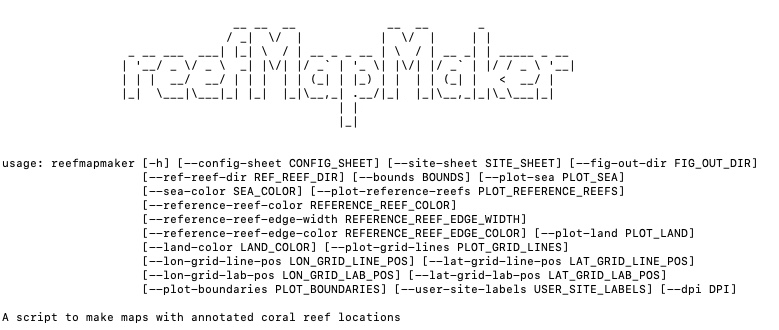

# reefMapMaker


reefMapMaker produces a map figure (.png and .svg format) of a user specified region
that is annotated with a reference set of coral reef 
locations as well as user-specified sites.

## Contents
* [Introduction](#introduction)
* [Installation](#installation)
    1. [Installation of the reefMapMaker code and dependencies](#1-installation-of-the-reefmapmaker-code-and-dependencies)
    2. [Installation of the reference reef shapefile and meta information](#2-installation-of-the-reference-reef-shapefile-and-meta-information)
* [Usage](#usage)

## Introduction
reefMapMaker produces a map figure (.png and .svg format) of a user specified region
that is annotated with a reference set of coral reef 
locations as well as user-specified sites.
The locations of the reference reefs are imported from the [Global Distribution of Coral 
Reefs dataset](https://data.unep-wcmc.org/datasets/1).

This dataset is compiled from a number of sources by UNEP World Conservation Monitoring Centre
(UNEP-WCMC) and the WorldFish Centre, in collaboration with WRI (World Resources Institute) and
TNC (The Nature Conservancy).

reefMapMaker is written in Python and leverages 
the [cartopy](https://scitools.org.uk/cartopy/docs/latest/) and 
[matplotlib](https://matplotlib.org/) libraries to produce its maps.

reefMapMaker is designed to simplify the task of producing publication-ready map figures that
detail the locations of user-specified points of interest. Making such maps is often undertaken
using R- or Python-based packages/scripts. However, doing so can often be time consuming and require
considerable experience/familiarity with the mapping libraries in question.
 
reefMapmaker is designed to enable users with no prior experience in scripting languages to produce publication-ready
maps of reef/site locations such as the one shown below. The output of reefMapMaker is a set of .png and .svg files.
The .svg file can be imported into a vector-based graphics editor of the user's choice for further manipulation.

An example output:

 

## Installation

Installation of reefMapMaker can be considered in two parts
1. Installation of the reefMapMaker code and dependencies
2. Installation of the reference reef shapefile and meta information

### 1. Installation of the reefMapMaker code and dependencies
This is easiest done using [conda](https://docs.conda.io/projects/conda/en/latest/).

#### For those familiar with conda:
`conda install -c didillysquat -c conda-forge reefmapmaker`

#### For those unfamiliar with conda:
##### Install conda
conda is a package and environment manager program.

It is most commonly installed as part of Anaconda or Miniconda.

Downloading and installing either of Anaconda or Miniconda will give you access to conda
and allow you to install reefMapMaker.

Anaconda comes with many scientific packages preinstalled and is therefore much larger than Miniconda
that comes with only conda and Python and the packages they depend on.

See the [docs](https://docs.anaconda.com/anaconda/install/) for installation.

##### Create a new environment and install reefMapMaker
It is advisable to install reefMapMaker in a new conda environment.

A new environment called reefmapmaker_env (change this name to whatever you like)
can be created with reefMapMaker installed using the following single command:

`conda create --name reefmapmaker_env -c didillysquat -c conda-forge reefmapmaker`

You will then need to activate the environment

`conda activate reefmapmaker_env`

### 2. Installation of the reference reef shapefile and meta information
Due to [license/use restrictions](https://www.unep-wcmc.org/policies/general-data-license-excluding-wdpa#data_policy),
the shapefile that contains the data for the reference
reefs cannot be included as part of this package, nor can it be automatically downloaded by this package.

To install the reference reef dataset, download the dataset from here:
https://data.unep-wcmc.org/datasets/1

N.B. If the download does not start when you click on
the download button, right click, then 'open in new tab'.

Once downloaded, decompress the .zip file and place the entire directory
(currently '14_001_WCMC008_CoralReefs2018_v4') someplace safe and note the location.
Do not change the names of the downloaded files.

By default, reefMapMaker will look for the reference reef datafiles in your current working
directory. Alternatively you can supply the path to the directory using the
```--ref-reef-dir``` argument.

N.B. make sure to place the shape directory somewhere the script will be able to access it.
E.g. if running on MacOS, do not place the directory in a /Applications or a similar directory or subdirectory.

## Usage
### Basic usage
Once installed reefmapmaker is run by typing:

`reefmapmaker`

If run without any parameters
the output will be a global map with the reef locations plotted using default parameters. This map will be output
as a .png and a .svg. For most applications, the user will want to further manipulate the .svg file
in their vector graphics software of choice.

reefmapmker will write the config parameters and values being used to stdout.
You will see counts of the number of reefs checked, and the number of reefs added to your plot.
It is normal for some of the checked reefs to produce errors.
A count of these will be output towards the end of the script.

N.b. when running reefmapmaker for the first time, it could take a little longer to start due
to one of the graphics packages it relies on having to generate caches.

#### Map configuration
The map may be further refined using a set of configuration options. These may be provided either via the command
line arguments or by providing a config_sheet in either .tsv (tab separated format) of .xlsx format.
An example [config sheet](./config_sheet.tsv) is contained in this repo.
To use a config_sheet, provide the full path to the sheet to the `--config_sheet` argument.

```--config_sheet <FULL/PATH/TO/SITE_SHEET.tsv>```

To see a full list of the config options that can be supplied either as command line arguments or in the config_sheet,
run: `reefmapmaker -h`.

**NB** When providing bounds on the command line, if the first coordinate is negative you must use an '=' sign:

```reefmapmaker --bounds=-90,160,-30,30```

If you ommit the '=' sign, python will interpret your negative coordinate as an additional commonline argument.

Similarly, when providing colors as hexcodes, you must also use an '=' sign:

```reefmapmaker --bounds=-90,160,-30,30 --sea-color=#D3D3D3```

#### User-provided site data
User provided sites may be plotted on the map by providing a site_sheet.
Pass the site_sheet argument to reeMapMaker:

```--site_sheet <FULL/PATH/TO/SITE_SHEET.tsv>```

An example [site_sheet](./site_sheet.tsv) is contained in this repo.
Sites are plotted as circles with user-defined face and edge colours.
The size of the circle radius should be given in decimal degrees. Edge weights will be calculated proportional to the
size of the circle.

#### Figure ouput
You can specifiy the directory to which you want the .png and .svg file saved using the 
`--fig-out-dir` flag.

#### Plotting reference reefs: polygons vs points
In the UNEP-WCMC shape file, the reference reefs are defined as polygon objects
(sets of x and y coordinates that make a perimeter of a reef).

For small scale maps (i.e. spanning < ~10 deg. lat. or lon.) it makes sense to plot these polygons directly to the map.
By default, these polygons are plotted as filled polygons with no edge line.
This keeps the plotting of reefs as accurate to the original coordinates as possible.
To apply an edge line to the polygons user may use the --reference-reef-edge-width argument
(a bigger value will increase the edge thickness; units are in points), e.g.:

```reefmapmaker --bounds 32,45,12,30 --reference-reef-edge-width 1```

However, for maps that span a large lat. or lon. it will become difficult to see the reefs.
By default, for maps with a lat. or lon. spanning > 10 deg.,
reefMapMaker will plot each reference reef record as a single point with
location calculated as an average of the x and y coordinates.
The user may adjust the size of the points using the --reference-reef-point-size argument, e.g.:

```reefmapmaker --bounds 32,45,12,30 --reference-reef-point-size 100```

The unit specifies the diameter of the points as a fraction of the shortest side of the map.
E.g. a value of 100 will plot points with a diameter that is 1/100 of the shortest side of the map.
For larger points make the number smaller.

### Updating reefmapmaker
As new versions of reefmapmaker are released you may wish to upgrade the version you have installed.
With your conda environment activated, you can run:
```conda update reefmapmaker -c didillysquat -c conda-forge```
